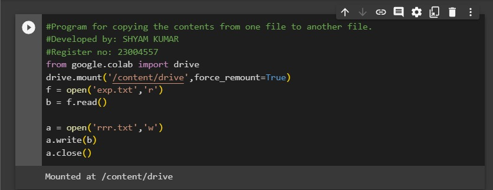
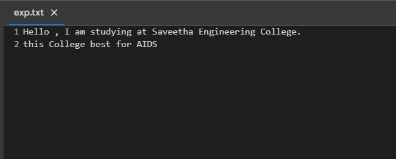
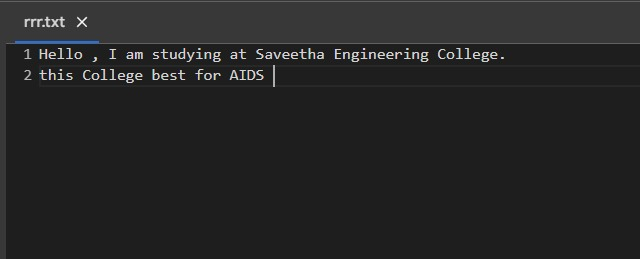

# copy-file
## AIM:
To write a python program for copying the contents from one file to another file.
## EQUIPEMENT'S REQUIRED: 
PC
Anaconda - Python 3.7
## ALGORITHM: 
### Step 1:
Open the source file in read mode.
### Step 2: 
Read the contents of the source file and store it in a variable.
### Step 3: 
Close the source file.
### Step 4:  
Open the destination file in write mode.if the file doesn't exist,it will be created.
### Step 5: 
Write the contents from the variable to the destination file.
### Step 6: 
Read the contents of the destination file and print it to verify the copy operation.
### Step 7:
End the program.
## PROGRAM:
```python
#Program for copying the contents from one file to another file.
#Developed by: SHYAM KUMAR
#Register no: 23004577
from google.colab import drive
drive.mount('/content/drive',force_remount=True)
f = open('exp.txt','r')
b = f.read()

a = open('rrr.txt','w')
a.write(b)
a.close()
```
### OUTPUT:





## RESULT:
Thus the program is written to copy the contents from one file to another file.